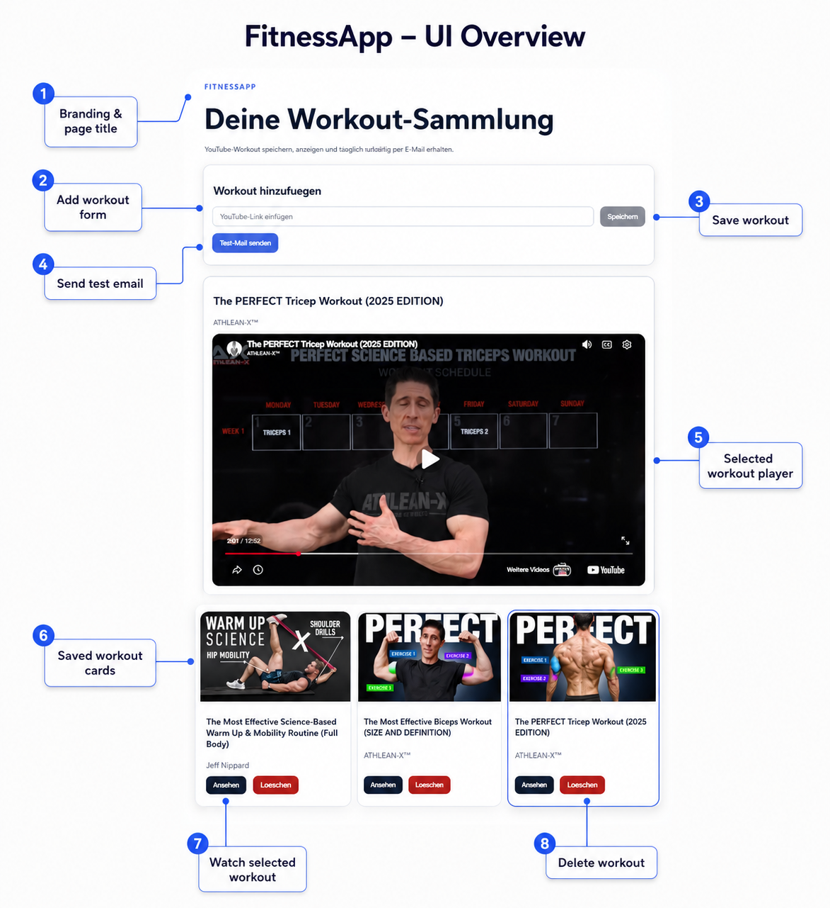

# FitnessApp


FitnessApp is a fullstack workout application built with Angular, ASP.NET Core, PostgreSQL and Docker.

The app allows users to save YouTube workout videos, automatically load video metadata, watch saved workouts in the browser and send a random workout by email.

## Screenshot



The screenshot shows the main user interface with the add-workout form, saved workout cards, selected workout player, test email action and delete/watch buttons.

## Features

- Save YouTube workout videos by URL
- Automatically fetch title, channel, thumbnail and video ID from the YouTube Data API
- Display all saved workouts in an Angular frontend
- Watch workouts directly inside the app using YouTube embeds
- Delete saved workouts
- Send a random workout by email
- Daily scheduled workout email with Hangfire
- PostgreSQL database integration
- Docker-based backend deployment
- Runtime frontend configuration through `config.json`
- Automated backend and frontend tests
- GitHub Actions CI workflow

## Tech Stack

### Frontend

- Angular 21
- TypeScript
- Reactive Forms
- HttpClient
- Standalone Components
- CSS
- Vitest

### Backend

- ASP.NET Core Web API
- .NET 10
- Entity Framework Core
- Npgsql PostgreSQL Provider
- Hangfire
- MailKit
- YouTube Data API v3
- xUnit
- Moq
- FluentAssertions
- EF Core InMemory Provider

### Database

- PostgreSQL
- Local development with Docker Compose
- Supabase / PostgreSQL for hosted database usage

## Project Structure

```txt
FitnessApp/
├── backend/
│   ├── FitnessApp.Api/
│   └── FitnessApp.Api.Tests/
│       ├── Integration/
│       └── Services/
├── frontend/
│   └── fitnessapp-web/
│       └── src/
├── docs/
│   ├── api-tests.http
│   └── screenshots/
├── .github/
│   └── workflows/
│       └── ci.yml
├── docker-compose.yml
├── .gitignore
└── README.md
```

## How the App Works

1. A user enters a YouTube workout URL in the Angular frontend.
2. The frontend sends the URL to the ASP.NET Core backend.
3. The backend extracts the YouTube video ID.
4. The backend requests metadata from the YouTube Data API.
5. The workout is saved in PostgreSQL.
6. The frontend displays the saved workout with title, channel and thumbnail.
7. The user can watch the video directly inside the app.
8. Hangfire can send a random workout by email.

## Local Setup

### Requirements

- Git
- Docker
- .NET 10 SDK
- Node.js 24
- Angular CLI 21
- Gmail app password
- YouTube Data API key

## Start PostgreSQL

```bash
docker compose up -d
```

## Start Backend

```bash
cd backend/FitnessApp.Api
dotnet restore
dotnet ef database update
dotnet run
```

Backend URL:

```txt
http://localhost:5000
```

Health check:

```bash
curl http://localhost:5000/health
```

## Start Frontend

```bash
cd frontend/fitnessapp-web
npm install
npm start
```

Frontend URL:

```txt
http://localhost:4200
```

## Local Configuration

Create this file locally:

```txt
backend/FitnessApp.Api/appsettings.Development.json
```

Example:

```json
{
  "ConnectionStrings": {
    "DefaultConnection": "Host=localhost;Port=5432;Database=fitnessapp;Username=fitnessapp;Password=fitnessapp_dev_password"
  },
  "YouTube": {
    "ApiKey": "YOUR_YOUTUBE_API_KEY"
  },
  "Mail": {
    "UserName": "your.gmail.account@gmail.com",
    "Password": "YOUR_GMAIL_APP_PASSWORD",
    "FromEmail": "your.gmail.account@gmail.com",
    "ToEmail": "recipient@example.com"
  },
  "Hangfire": {
    "DailyWorkoutCron": "0 8 * * *",
    "TimeZone": "Europe/Berlin"
  },
  "AllowedOrigins": [
    "http://localhost:4200"
  ]
}
```

Do not commit real API keys, passwords or connection strings.

## Frontend Runtime Config

Local frontend config:

```txt
frontend/fitnessapp-web/public/config.json
```

Example:

```json
{
  "apiBaseUrl": "http://localhost:5000"
}
```

## API Endpoints

| Method | Endpoint | Description |
|---|---|---|
| GET | `/health` | Health check |
| GET | `/api/workouts` | Get all workouts |
| POST | `/api/workouts` | Add a YouTube workout |
| DELETE | `/api/workouts/{id}` | Delete a workout |
| POST | `/api/workouts/send-random` | Send a random workout email |

## Example Request

```http
POST http://localhost:5000/api/workouts
Content-Type: application/json

{
  "youtubeUrl": "https://www.youtube.com/watch?v=VIDEO_ID"
}
```

## Testing

The project contains automated backend and frontend tests.

### Backend Tests

Run from the project root:

```bash
dotnet test
```

Backend tests include:

- Unit tests for YouTube URL parsing
- Unit tests for workout service logic
- Unit tests for scheduled workout job logic
- Integration tests for API endpoints
- InMemory database usage for test isolation
- Mocked external services for YouTube and email sending

### Frontend Tests

Run from the frontend folder:

```bash
cd frontend/fitnessapp-web
npm test
```

For CI-style test execution:

```bash
npm run test:ci
```

With coverage:

```bash
npm run test:ci -- --coverage
```

Frontend tests include:

- Angular component tests
- API service tests
- HTTP request tests with mocked backend responses
- Error handling tests

## Continuous Integration

This repository uses GitHub Actions for automated checks.

The CI workflow runs on pushes and pull requests and performs:

- Backend restore
- Backend build
- Backend tests
- Frontend install
- Frontend build
- Frontend tests

Workflow file:

```txt
.github/workflows/ci.yml
```

## Deployment

The backend is prepared for Docker-based deployment and can be hosted on Render.

The database can be provided by Supabase or another PostgreSQL provider.

Environment variables required for deployment include:

```txt
DATABASE_URL
YouTube__ApiKey
Mail__UserName
Mail__Password
Mail__FromEmail
Mail__ToEmail
AllowedOrigins__0
```

The frontend uses runtime configuration through:

```txt
public/config.json
```

## Security Notes

Do not commit:

- Gmail app passwords
- YouTube API keys
- production database URLs
- real connection strings
- local secret configuration files

Use environment variables or local ignored configuration files instead.

## Author

Created by [DjemIsm](https://github.com/DjemIsm)